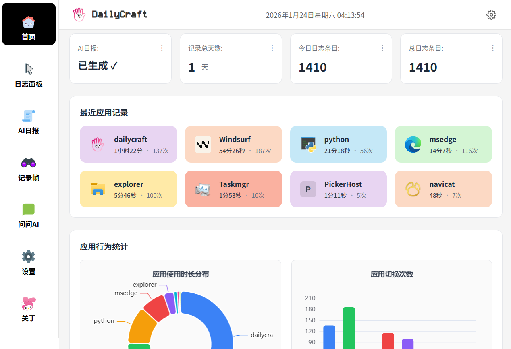
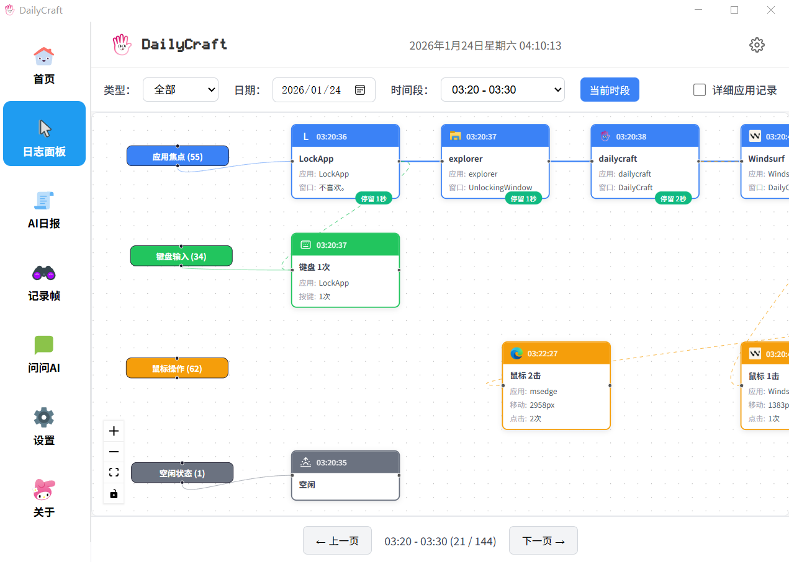
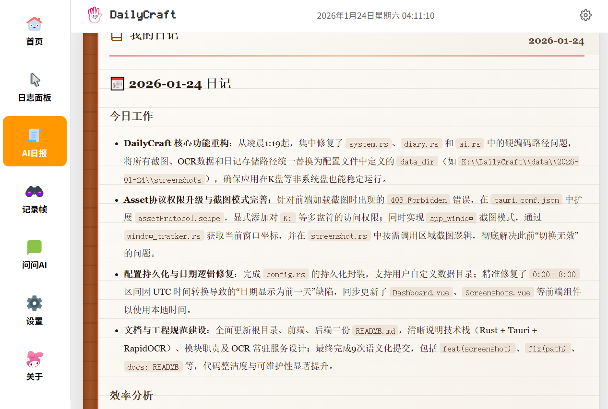
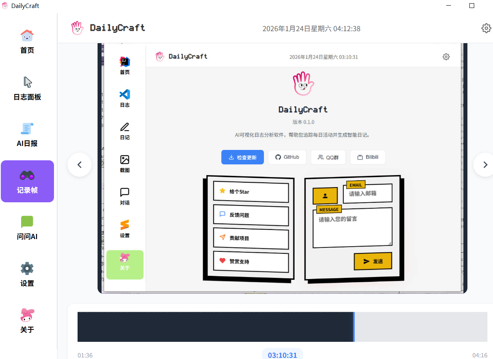

# DailyCraft - AI可视化日志分析软件

> 你今天做了什么？通过监控电脑操作，实时记录用户活动，生成AI日记。

**技术栈**: Tauri 2.0 + Vue 3 + TypeScript + Rust

## 📸 应用截图

| 首页 | 活动日志 |
|:---:|:---:|
|  |  |

| AI日记 | AI对话 |
|:---:|:---:|
|  |  |

| 视频帧管理 |
|:---:|
|  |

## ✨ 功能特性

- **活动监控**: 自动追踪应用使用、窗口切换、键鼠活动
- **智能截图**: 支持全屏/应用窗口模式，可配置触发条件
- **OCR识别**: 常驻进程模式的RapidOCR，低CPU占用
- **AI日记**: 基于OpenAI/兼容API，自动生成每日日记
- **AI对话**: 支持流式对话，多会话管理，本地历史保存
- **可视化**: 时间线视图、活动流程图、截图浏览
- **本地存储**: 数据完全本地化，支持自定义存储路径

## 🚧 开发计划

- [ ] 检查更新功能（GitHub Releases API）
- [ ] 数据备份导出功能
- [ ] 数据导入恢复功能
- [ ] 自动更新安装（tauri-plugin-updater）

## 🚀 快速开始

### 环境准备

1. **Python 3.x** - OCR功能依赖
   ```bash
   # 安装OCR依赖
   pip install rapidocr_onnxruntime
   ```

2. **Rust 1.70+** - 后端编译
   ```bash
   # 安装Rust: https://rustup.rs/
   rustup update stable
   ```

3. **Node.js 18+** - 前端开发
   ```bash
   # 推荐使用 nvm 管理Node版本
   ```

### 运行项目

```bash
# 克隆项目
git clone https://github.com/Chujie-cre/DailyCraft.git
cd DailyCraft

# 安装依赖
npm install

# 开发模式
npm run tauri dev

# 构建发布
npm run tauri build
```

## 📁 项目结构

```
DailyCraft/
├── src/                      # Vue 前端展示
│   ├── views/                # 页面组件
│   │   ├── Home.vue          # 首页仪表盘
│   │   ├── Dashboard.vue     # 活动日志面板
│   │   ├── Diary.vue         # AI日记生成
│   │   ├── Chat.vue          # AI对话
│   │   ├── Screenshots.vue   # 记录帧时间轴
│   │   ├── Settings.vue      # 设置页面
│   │   └── About.vue         # 关于页面
│   ├── components/           # 通用组件
│   │   ├── Toast.vue         # 消息提示
│   │   ├── UpdateDialog.vue  # 更新对话框
│   │   ├── flow/             # 流程图组件
│   │   └── layout/           # 布局组件
│   ├── api/                  # API 接口封装
│   │   ├── activity.ts       # 活动数据接口
│   │   ├── ai.ts             # AI 相关接口
│   │   ├── diary.ts          # 日记接口
│   │   └── update.ts         # 更新检查接口
│   └── types/                # TypeScript 类型定义

├── src-tauri/                # Rust 后端 - 核心功能
│   ├── src/
│   │   ├── commands/         # Tauri 命令
│   │   │   ├── ai.rs         # AI 配置与对话
│   │   │   ├── diary.rs      # 日记生成
│   │   │   ├── system.rs     # 系统监控命令
│   │   │   └── update.rs     # 更新检查
│   │   ├── models/           # 数据模型
│   │   │   ├── config.rs     # 应用配置
│   │   │   ├── event.rs      # 事件结构
│   │   │   └── segment.rs    # 时间段模型
│   │   └── services/         # 核心服务
│   │       ├── storage.rs    # 数据存储
│   │       ├── window_tracker.rs   # 窗口追踪
│   │       ├── input_tracker.rs    # 输入追踪
│   │       ├── screenshot.rs       # 截图服务
│   │       ├── ocr.rs              # OCR 调用
│   │       └── icon_extractor.rs   # 图标提取
│   └── scripts/
│       └── ocr_service.py    # Python OCR 服务
```

## ⚙️ 配置说明

- **存储路径**: 设置 > 数据目录
- **截图模式**: 全屏(full_screen) / 应用窗口(app_window)
- **AI配置**: 设置 > AI配置 > API Key / Base URL


### 反馈问题

遇到问题？请在 [Issues](https://github.com/Chujie-cre/DailyCraft/issues) 中反馈。

## 📄 版本

v0.1.5 - 开发测试中

## 📜 许可证

MIT License